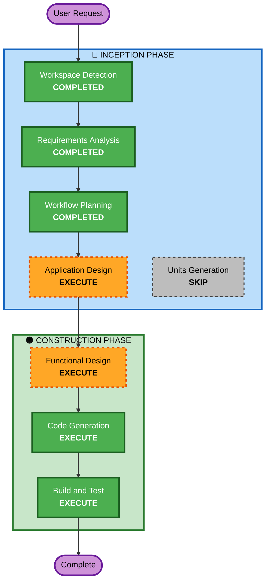

# Execution Plan

## Detailed Analysis Summary

### Change Impact Assessment
- **User-facing changes**: Yes — new CLI application with 5 core features
- **Structural changes**: Yes — new project from scratch, multiple modules
- **Data model changes**: Yes — recipe, meal plan, grocery list data models
- **API changes**: N/A — CLI application, no API
- **NFR impact**: Yes — input validation, PBT testing, performance targets

### Risk Assessment
- **Risk Level**: Low (greenfield, no production impact, local-only MVP)
- **Rollback Complexity**: Easy (no deployment, no data migration)
- **Testing Complexity**: Moderate (PBT extension requires property-based tests)

## Workflow Visualization



### Text Alternative
```
INCEPTION PHASE:
  Workspace Detection    -> COMPLETED
  Requirements Analysis  -> COMPLETED
  Workflow Planning      -> COMPLETED
  User Stories           -> SKIPPED (simple single-user CLI, no multiple personas)
  Application Design     -> EXECUTE (new components and service layer needed)
  Units Generation       -> SKIP (single unit of work, no decomposition needed)

CONSTRUCTION PHASE:
  Functional Design      -> EXECUTE (data models and business logic need design)
  NFR Requirements       -> SKIP (tech stack decided, no complex NFR patterns)
  NFR Design             -> SKIP (no NFR Requirements to incorporate)
  Infrastructure Design  -> SKIP (local CLI app, no infrastructure)
  Code Generation        -> EXECUTE (always)
  Build and Test         -> EXECUTE (always)
```

## Phases to Execute

### 🔵 INCEPTION PHASE
- [x] Workspace Detection (COMPLETED)
- [x] Requirements Analysis (COMPLETED)
- [ ] User Stories — SKIPPED
  - **Rationale**: Single-user CLI app, one persona (busy professional), no complex user workflows requiring story decomposition
- [x] Workflow Planning (IN PROGRESS)
- [ ] Application Design — EXECUTE
  - **Rationale**: New components needed (RecipeManager, MealPlanner, GroceryListGenerator); service layer and component interactions need definition
- [ ] Units Generation — SKIP
  - **Rationale**: Single unit of work — all 5 features are tightly coupled (recipes feed meal plans feed grocery lists). No decomposition needed.

### 🟢 CONSTRUCTION PHASE
- [ ] Functional Design — EXECUTE
  - **Rationale**: Data models (Recipe, MealPlan, GroceryList), business logic (ingredient scaling, quantity merging), and PBT property identification (PBT-01) required
- [ ] NFR Requirements — SKIP
  - **Rationale**: Tech stack already decided (TypeScript/Node.js, fast-check). No complex NFR patterns to evaluate.
- [ ] NFR Design — SKIP
  - **Rationale**: No NFR Requirements stage to build upon
- [ ] Infrastructure Design — SKIP
  - **Rationale**: Local CLI application with JSON file storage. No cloud infrastructure.
- [ ] Code Generation — EXECUTE (ALWAYS)
  - **Rationale**: Implementation planning and code generation needed
- [ ] Build and Test — EXECUTE (ALWAYS)
  - **Rationale**: Build, test, and verification needed

### 🟡 OPERATIONS PHASE
- [ ] Operations — PLACEHOLDER

## Estimated Timeline
- **Total Stages to Execute**: 4 (Application Design, Functional Design, Code Generation, Build and Test)
- **Estimated Duration**: ~1.5 hours remaining of 2-hour MVP target

## Success Criteria
- **Primary Goal**: Working CLI app that plans weekly meals and generates consolidated grocery lists
- **Key Deliverables**: TypeScript CLI with recipe CRUD, meal calendar, grocery list generation with check-off
- **Quality Gates**: All PBT tests pass, input validation on all commands, <500ms response time
